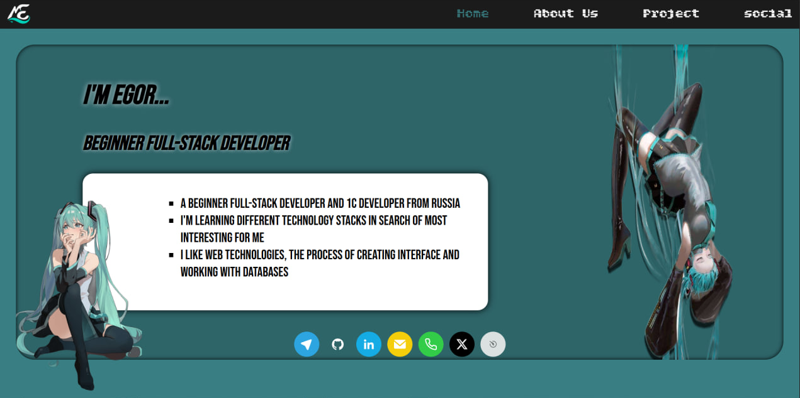
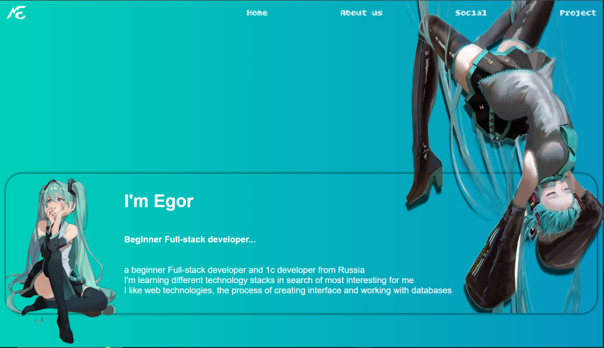
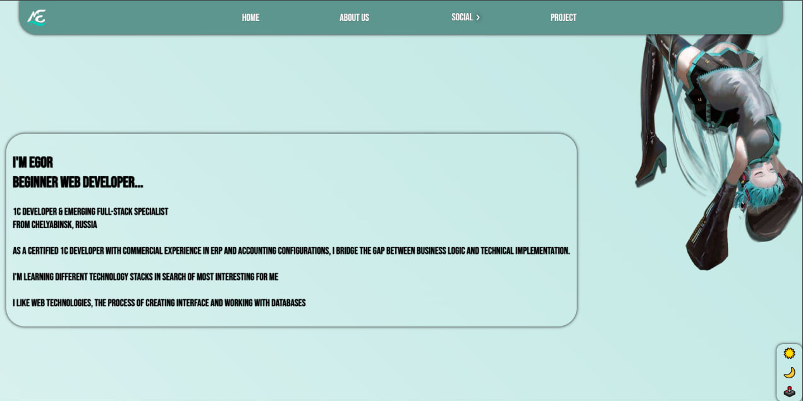

## My business card site
### Hello everyone 👋

This project is my first serious website and the first project after two years of severe depression and attempts to take my own life.
I struggled with this disease for 2 years, and after a long therapy, I returned to programming. Completely burned out, I am trying to find my own business, which would become my calling and meaning.

I decided to start my return to life with a simple business card site, written completely from scratch.

Briefly about what was done:
⚫Added full adaptability for all device screen sizes 
⚫Completely redesigned color scheme and user-friendliness of the interface as a whole 
⚫Added change of design themes (light/night/classic) 
⚫The site structure was completely redesigned for the BEM system 
⚫Added many tactile elements for the user 
⚫Working with local storage and login are written in pure JS. 
⚫Created a mobile version of the project, which works great on any device up to iPhone 15 
⚫Created drop-down menus and a mobile menu 
⚫Worked with CSS semantics 
⚫Worked with media queries 
⚫This site is made in pure CSS and JS using BEM and is my calling card 

What was involved: CSS3, HTML5, JS, GIT

This is how the site versions changed:
#### V1.0

#### V2.0

#### V3.0

